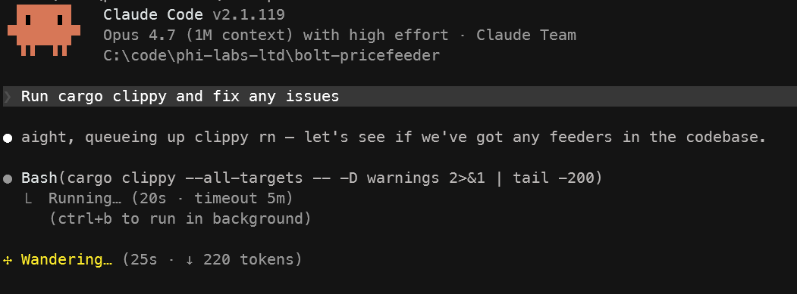

# claude

Claude Code plugins by and for Phi Labs Ltd.

## Plugins

| Plugin | Ships | Description |
| --- | --- | --- |
| [`personalities`](./plugins/personalities) | Output styles | Different voices for Claude. Currently: **Crypto Bro**. |
| [`developer`](./plugins/developer) | Agents, skills | Developer tooling. Currently: the **`second-set-of-eyes`** review agent, the **`protocol-formalizer`** Quint-spec agent, the **`karpathy`** engineering-discipline skill, and the **`FormalSpecification`** Quint-spec skill. |
| [`bolt-theme`](./plugins/bolt-theme) | Theme | A dark color theme with Bolt Liquidity's signature yellow accent. |
| [`liquidity-team`](./plugins/liquidity-team) | Skills | Tooling for the liquidity team. |

## Install

Add the marketplace once:

```
/plugin marketplace add phi-labs-ltd/claude
```

Then install any plugin you want:

```
/plugin install personalities@phi-labs-ltd
/plugin install developer@phi-labs-ltd
/plugin install bolt-theme@phi-labs-ltd
/plugin install liquidity-team@phi-labs-ltd
```

Run `/reload-plugins` after installing for it to take effect.

## Using each plugin

### `personalities`

Pick a voice with `/config` → **Output style** → **personalities:crypto-bro**. Revert with `/config` → **Output style** → **Default**.

### `developer`

#### Agents

- **`second-set-of-eyes`** — an independent-review agent that reads your pending diff with the critical eye of a senior engineer. Ask for a "second opinion", "sanity check", or "review my changes" and Claude will delegate to it. Read-only: it cannot edit, stage, or commit.
- **`protocol-formalizer`** — an agent that drafts [Quint](https://quint.sh) specifications from user stories, tickets, PDFs, pseudocode, or existing implementations. Works from a protocol-designer mindset: models what the protocol _should_ do, not what the code currently does, and flags spec-vs-code divergences (e.g., invariants the implementation is missing). Delegated to on "write a spec", "formalize this", "draft a Quint spec", or proactively when editing smart contracts on Sui / Solana / Ethereum.

#### Skills

- **`karpathy`** — an engineering-discipline skill (think before coding, simplicity first, surgical changes, goal-driven execution). Loads automatically on non-trivial code tasks.
- **`formal-specification`** — a skill that guides a three-phase workflow for producing a Quint spec: draft the model, negotiate invariants collaboratively, then write comprehensive deterministic tests. Includes a Quint syntax cheatsheet, house-style guide, invariant-pattern catalogue, and `quint-connect` trace-replay integration notes. The `protocol-formalizer` agent uses this skill; it also loads directly when you ask to "formalize" or "convert this into a spec".

### `bolt-theme`

Run `/theme` and pick **Bolt Liquidity** — a dark base with Bolt's signature yellow (`#FFED2C`) for Claude's voice.




### `liquidity-team`

#### Skills

- **`bolt-pricefeeder-deployer`** — a skill for the liquidity team to validate calibration / parameter-update requests for [bolt-pricefeeder](https://github.com/phi-labs-ltd/bolt-pricefeeder) before they become a Linear ticket. Triggers automatically whenever pricefeeder knobs are being discussed (chat messages, pasted tables, casual proposals like "can we bump `base_alpha` to 0.012?"). Fetches the latest released config schema from GitHub Pages, classifies each proposed knob as `DIRECT MATCH` / `NAME TRANSLATION` / `UNIT DRIFT` (decimal-on-`Bps` field, off by 10000×) / `UNKNOWN`, and surfaces every discrepancy as an explicit question — never silently rewrites a name or auto-converts a unit.
